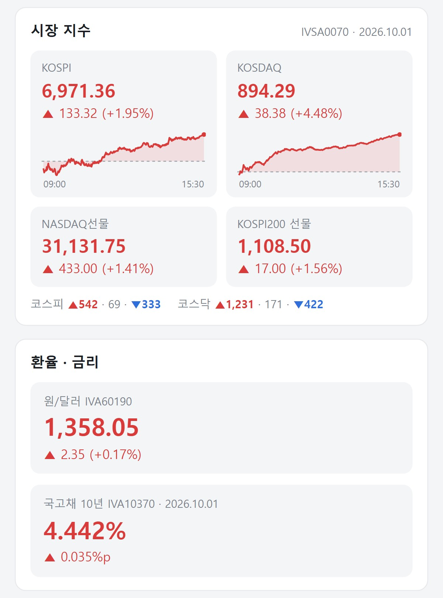
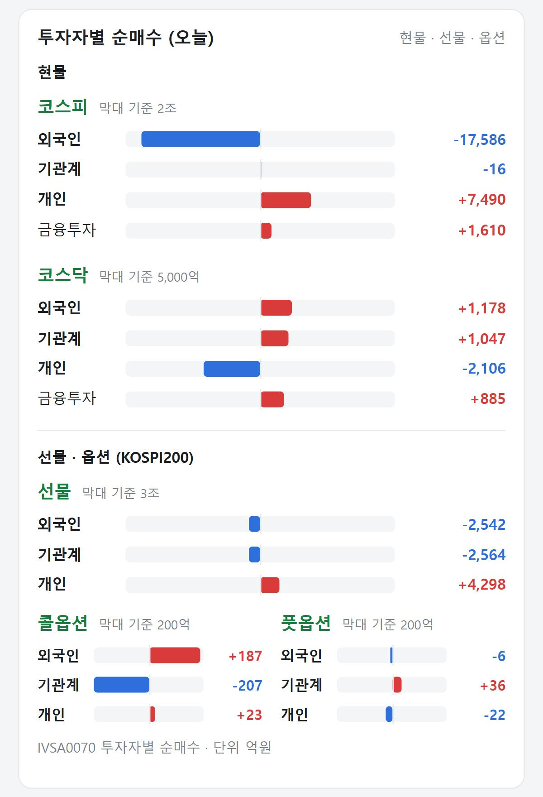
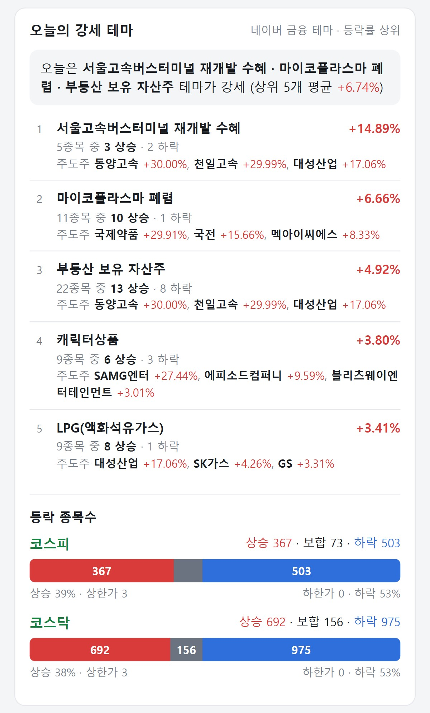

# 26년 10월 3일 국내 장마감 수급 체크

업데이트: 2026-10-03 01:13 (평일 15:50 자동)

```
■ 지수
- 코스피 7,003.74 (▲32.39, +0.46%)
- 코스닥 893.29 (▼1.00, -0.11%)
- 나스닥 선물 31,110.25 (▲349.75, +1.14%)
- 원/달러 1,346.10원 (▼12.30, -0.91%)
- 국고채 10년 4.365% (-7.1bp, -1.60%)

■ 투자자별 순매수 (억원)
- 코스피: 외국인 -1,011 / 기관 +4,155 / 개인 -17,897
- 코스닥: 외국인 -1,779 / 기관 +935 / 개인 +844

■ 선물·옵션 (KOSPI200, 억원)
- KOSPI200 선물 202612 1,125.05 (▲11.85, +1.06%)
- 선물·옵션 수급: 장 마감 약 1시간 뒤 KB에서 초기화되어 표시할 값이 없습니다.

■ 오늘의 강세 테마 (네이버 금융 테마 등락률 상위)
오늘은 광통신 · 정유 · 통신장비 테마가 강세였습니다.
1. 광통신(광케이블/광섬유 등) +9.38% — 15종목 모두 상승 · 주도주 티엠씨 +29.95%, 머큐리 +29.80%, 빛샘전자 +12.82%
2. 정유 +7.35% — 3종목 모두 상승 · 주도주 S-Oil +10.82%, SK이노베이션 +8.38%, GS +2.84%
3. 통신장비 +6.17% — 47종목 중 42 상승 · 주도주 티엠씨 +29.95%, 머큐리 +29.80%, 와이어블 +18.59%
4. 애플페이 +4.66% — 8종목 모두 상승 · 주도주 이루온 +14.82%, 엑스플러스 +10.82%, 나이스정보통신 +7.21%
5. 스페이스X(SpaceX) +4.40% — 14종목 중 12 상승 · 주도주 와이제이링크 +11.52%, 나노팀 +8.53%, 센서뷰 +7.97%

■ 등락 종목수
- 코스피: 상승 577 (상한 1) / 보합 71 / 하락 295 (하한 0)
- 코스닥: 상승 1,109 (상한 4) / 보합 153 / 하락 562 (하한 0)

▶ 한 줄 요약: 외국인 코스피 현물 순매도, 코스피 +0.46% 상승 마감

(데이터: KB증권 OpenAPI · 2026-10-03 01:13 기준)
```







## 파일
- [latest/장마감 수급체크.html](latest/) — 내려받아(Download raw) 브라우저로 열면 차트 확대·체크박스·값 확인 가능
- [archive/](archive/) — 날짜별 기록
